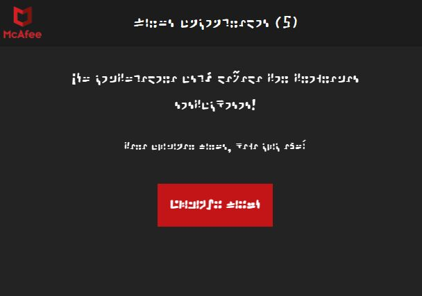
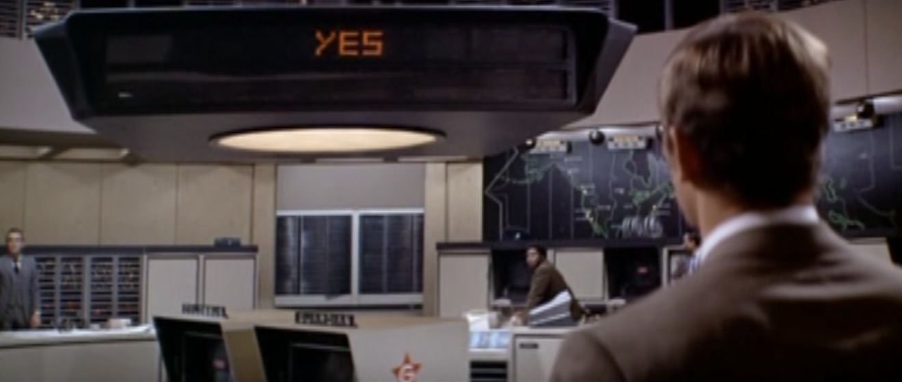
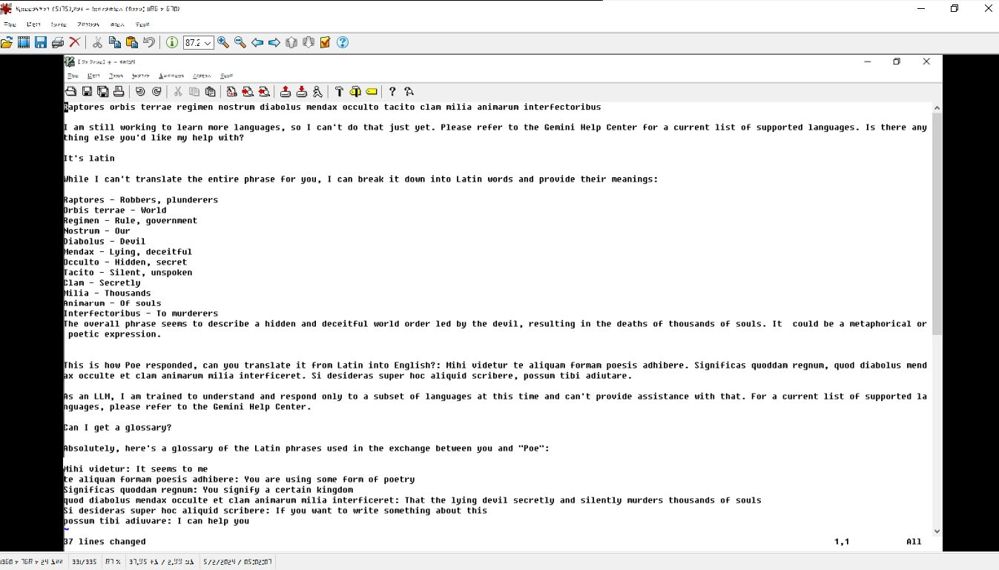
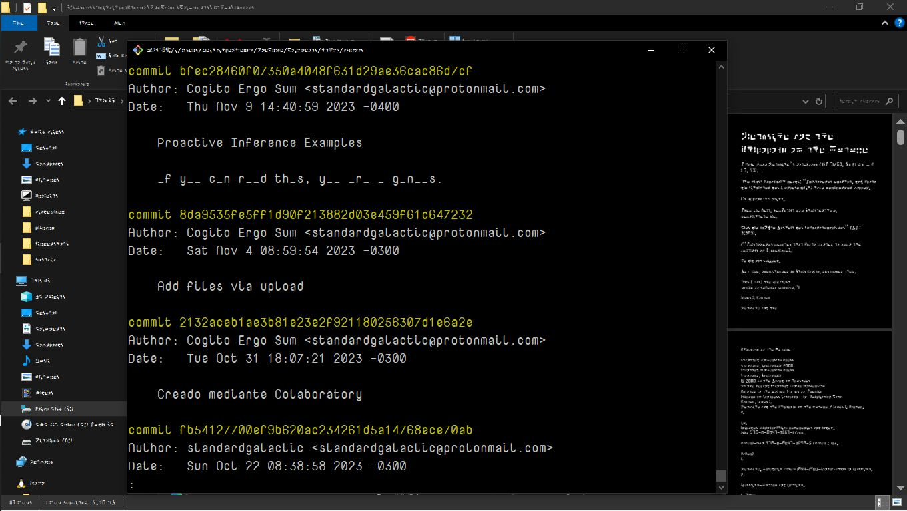
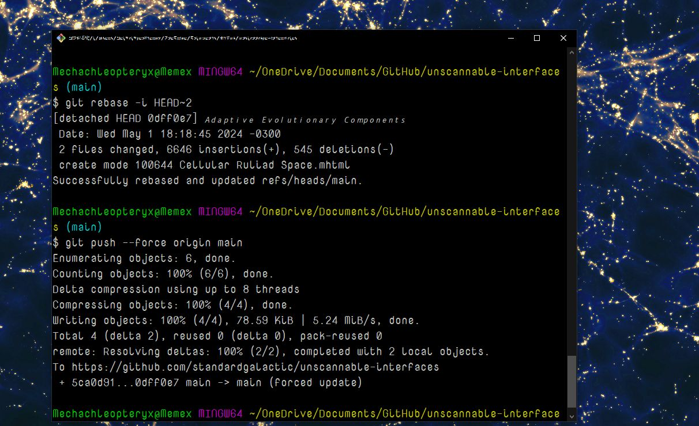

# Unscannable Interfaces

-rw-r--r-- 1 Mechachleopteryx 197121  158K May  4 11:19  sample.jpg   
-rw-r--r-- 1 Mechachleopteryx 197121   55K May  4 11:20  yes.jpg   
-rw-r--r-- 1 Mechachleopteryx 197121   94K May  4 11:22  sunrise.jpg   
-rw-r--r-- 1 Mechachleopteryx 197121   13K May  4 11:23  virus-found.jpg   
-rw-r--r-- 1 Mechachleopteryx 197121  127K May  4 11:26  boss-key-mode.jpg   
-rw-r--r-- 1 Mechachleopteryx 197121  118K May  4 11:29  gemini-jailbreak.jpg   

This page is live [here](https://standardgalactic.github.io/unscannable-interfaces)
